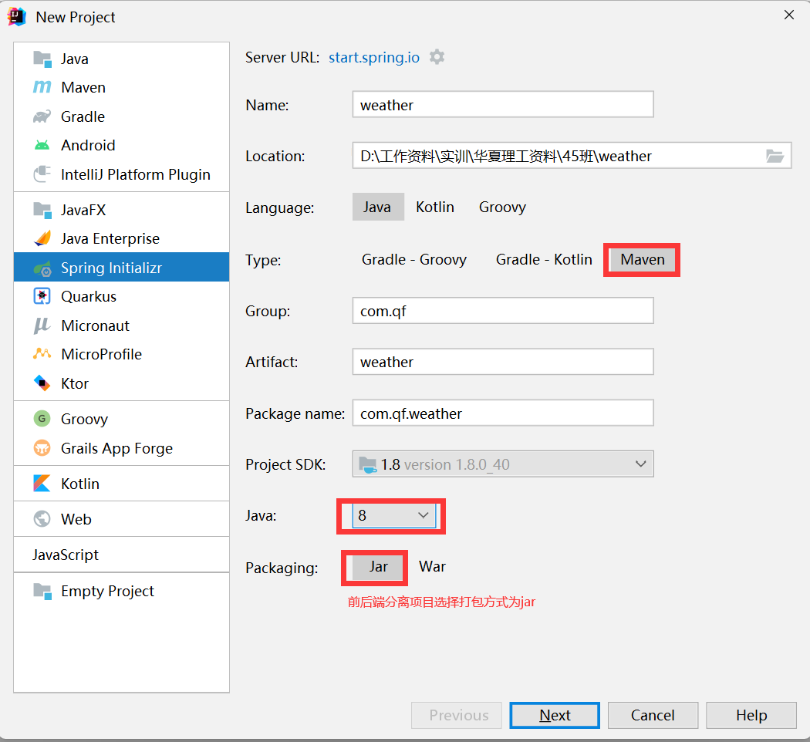
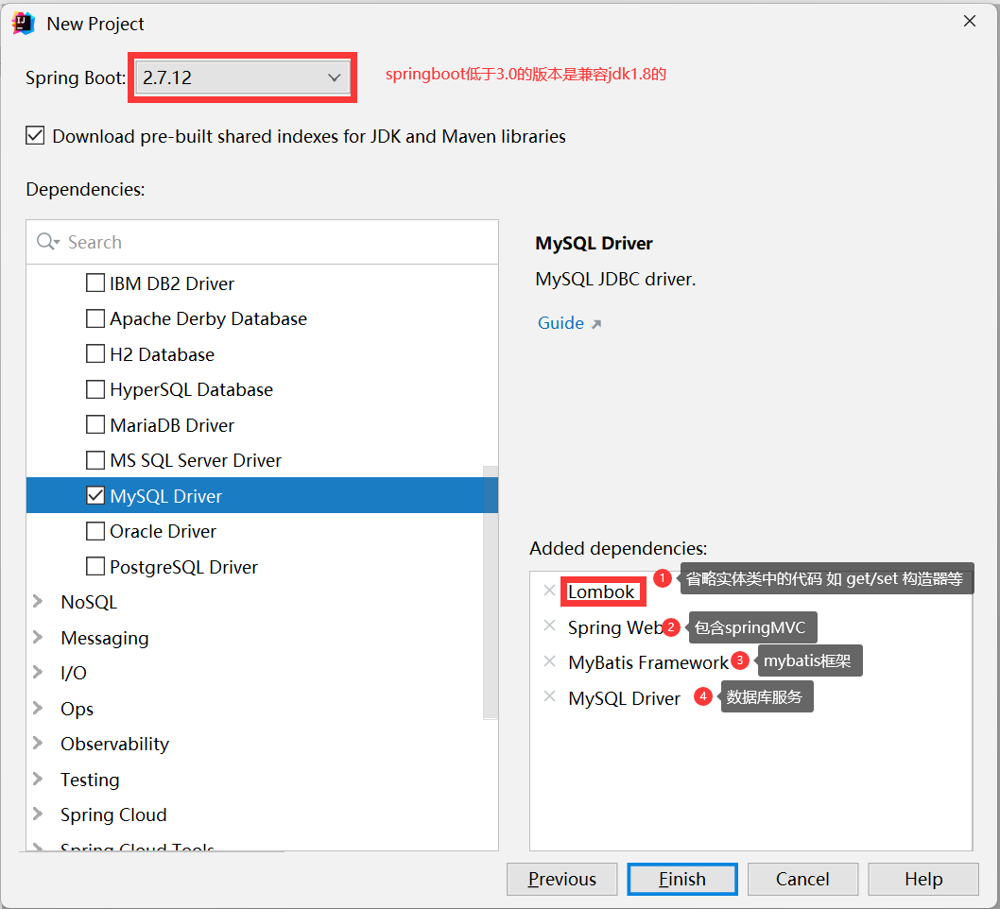
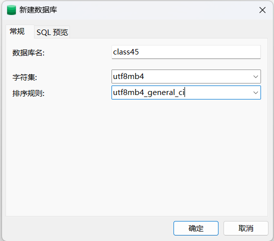

# 实训资料

## 一、完成目标

前后端分离的项目:

前端技术:Vue+Element UI

后端技术:SpringBoot + SSM + MySQL


开发环境:IDEA 2022  + MySQL8.0 + navicat 16 + HBuilder X 任意版本

## 二、实现内容

### 2.1 后端项目搭建

#### 2.1.1 项目创建






#### 2.1.2 配置文件信息

> application.properties文件

> ```properties
> # 端口号
> server.port=9999
> 
> # 连接数据库的服务
> spring.datasource.driver-class-name=com.mysql.cj.jdbc.Driver
> 
> # 数据库连接地址:jdbc:mysql://ip:port/数据库名?characterEncoding=utf-8
> spring.datasource.url=jdbc:mysql://localhost:3306/bookdb?characterEncoding=utf-8
> # 用户名
> spring.datasource.username=root
> # 密码
> spring.datasource.password=123456
> 
> # 给mybatis中的所需实体类设置别名
> mybatis.type-aliases-package=com.qf.weather.bean
> 
> # 绑定mybatis所需的xml文件
> mybatis.mapper-locations=classpath:mappers/*Mapper.xml
> ```

#### 2.1.3  创建数据库



#### 2.1.4 bean层

> ```java
> package com.qf.weather.bean;
> 
> import lombok.AllArgsConstructor;
> import lombok.Data;
> import lombok.NoArgsConstructor;
> import lombok.ToString;
> 
> /**
>  * description:
>  * author:姚哥
>  * 公众号:java架构栈
>  */
> /*
> * @Data:替换掉get/set
> * @AllArgsConstructor:替换掉全参构造器
> * @NoArgsConstructor:替换掉无参构造器
> * @ToString:替换掉toString方法
> * */
> @Data
> @AllArgsConstructor
> @NoArgsConstructor
> @ToString
> public class Book {
> 
>     //名称规范
>     private int bookId;
>     private String bookName;
>     private String bookAuthor;
>     private double bookPrice;
>     private String bookDesc;
> 
> }
> ```

#### 2.1.5 dao层

> 创建BookMapper接口

> ```java
> package com.qf.weather.dao;
> 
> import com.qf.weather.bean.Book;
> 
> import java.util.List;
> 
> public interface BookMapper {
> 
>     //查询所有的信息
>     List<Book> findAll();
> }
> ```

> 在资源目录下创建BookMapper.xml文件

> ```xml
> <?xml version="1.0" encoding="UTF-8" ?>
> <!DOCTYPE mapper
>         PUBLIC "-//mybatis.org//DTD Mapper 3.0//EN"
>         "https://mybatis.org/dtd/mybatis-3-mapper.dtd">
> <mapper namespace="com.qf.weather.dao.BookMapper">
> 
> <!--  让数据库表中的字段名与实体类中的属性名一一对应 映射  -->
>     <resultMap id="bookMap" type="book">
>         <id column="book_id" property="bookId"></id>
>         <result column="book_name" property="bookName"></result>
>         <result column="book_author" property="bookAuthor"></result>
>         <result column="book_price" property="bookPrice"></result>
>         <result column="book_desc" property="bookDesc"></result>
>     </resultMap>
> 
>     <select id="findAll" resultMap="bookMap">
>         select * from bookinfo
>     </select>
> </mapper>
> ```

#### 2.1.6 service层

> ```java
> package com.qf.weather.service;
> 
> import com.qf.weather.bean.Book;
> 
> import java.util.List;
> 
> public interface BookService {
> 
>     List<Book> findAll();
> }
> ```
>
> ```java
> package com.qf.weather.service.impl;
> 
> import com.qf.weather.bean.Book;
> import com.qf.weather.dao.BookMapper;
> import com.qf.weather.service.BookService;
> import org.springframework.stereotype.Service;
> 
> import javax.annotation.Resource;
> import java.util.List;
> 
> /**
>  * description:
>  * author:姚哥
>  * 公众号:java架构栈
>  */
> //@Service 表示将当前类交给spring管理
> @Service
> public class BookServiceImpl implements BookService {
> 
>     //依赖注入 相当于BookMapper mapper=new BookMapperImpl();
>     @Resource
>     BookMapper mapper;
> 
>     @Override
>     public List<Book> findAll() {
>         return mapper.findAll();
>     }
> }
> ```

#### 2.1.7 controller层

> ```java
> package com.qf.weather.controller;
> 
> import com.qf.weather.bean.Book;
> import com.qf.weather.service.BookService;
> import org.springframework.stereotype.Controller;
> import org.springframework.web.bind.annotation.RequestMapping;
> import org.springframework.web.bind.annotation.ResponseBody;
> 
> import javax.annotation.Resource;
> import java.util.List;
> 
> /**
>  * description:
>  * author:姚哥
>  * 公众号:java架构栈
>  */
> @Controller
> @RequestMapping("book")
> public class BookController {
> 
>     @Resource
>     BookService service;
> 
>     //localhost:9999/book/list
>     @RequestMapping("list")
>     @ResponseBody
>     public List<Book> bookList(){
>         return service.findAll();
>     }
> }
> ```

### 2.2 前端-vue

#### 2.2.1 vue是什么? 

> Vue (读音 /vjuː/，类似于 **view**) 是一套用于构建用户界面的**渐进式框架**。与其它大型框架不同的是，Vue 被设计为可以自底向上逐层应用。Vue 的核心库只关注视图层，不仅易于上手，还便于与第三方库或既有项目整合。另一方面，当与[现代化的工具链](https://v2.cn.vuejs.org/v2/guide/single-file-components.html)以及各种[支持类库](https://github.com/vuejs/awesome-vue#libraries--plugins)结合使用时，Vue 也完全能够为复杂的单页应用提供驱动。
>
> 采取的MVVM模式进行数据与视图的交互，方便数据的显示

> 引入案例
>
> ```html
> <!DOCTYPE html>
> <html>
> 	<head>
> 		<meta charset="utf-8" />
> 		<title></title>
> 		<!-- 1.引入vue.js -->
> 		<script src="./js/vue.js"></script>
> 	</head>
> 	<body>
> 		<!-- v:view视图部分 -->
> 		<div id="app">
> 			<!-- 插值表达式 -->
> 			<a href="#">{{str}}</a>
> 			{{name}}
> 		</div>
> 		<script>
> 			// m:model数据模型
> 			new Vue({
> 				el:"#app",
> 				data:{
> 					//这里放数据
> 					str:"kunkun",
> 					name:"fanfan"
> 				},  
> 				methods:{}//这里放自定函数
> 			})
> 		</script>
> 	</body>
> </html>
> 
> ```

#### 2.2.2 vue开发步骤

> 1. 在一个html中引入vue.js文件
>    * cdn引入:<script src="https://cdn.jsdelivr.net/npm/vue@2/dist/vue.js"></script>
>    * 下载后引入:<script src="./js/vue.js"></script>
> 2. 定义一个容器用来显示视图部分，一般情况下只有一个div
> 3. 需要定义一个vue的实例
>
> ```js
> new Vue({
> 				el:"#app",
> 				data:{
> 					//这里放数据
> 					str:"kunkun",
> 					name:"fanfan"
> 				},  
> 				methods:{}//这里放自定函数
> 			})
> ```

#### 2.2.3 对象渲染

> ```html
> <!DOCTYPE html>
> <html>
> 	<head>
> 		<meta charset="utf-8">
> 		<title></title>
> 		<!-- 1.引入vue.js -->
> 		<script src="./js/vue.js"></script>
> 	</head>
> 	<body>
> 		<div id="app">
> 			<p>学生编号:{{stu.stuNo}}</p>
> 			<p>学生姓名:{{stu.stuName}}</p>
> 			<p>学生性别:{{stu.stuGender}}</p>
> 			<p>学生年龄:{{stu.stuAge}}</p>
> 			<hr/>
> 			<p>学生编号:{{stu2.stuNo}}</p>
> 			<p>学生姓名:{{stu2.stuName}}</p>
> 			<p>学生性别:{{stu2.stuGender}}</p>
> 			<p>学生年龄:{{stu2.stuAge}}</p>
> 		</div>
> 		<script>
> 			new Vue({
> 				el: "#app",
> 				data: {
> 					//{}表示对象
> 					stu: {
> 						stuNo: "001",
> 						stuName: "fanfan",
> 						stuGender: "M",
> 						stuAge: 30
> 					},
> 					stu2: {
> 						stuNo: "002",
> 						stuName: "kunkun",
> 						stuGender: "F",
> 						stuAge: 29
> 					},
> 				}
> 			})
> 		</script>
> 	</body>
> </html>
> ```

#### 2.2.4 数组渲染

> ```html
> <!DOCTYPE html>
> <html>
> 	<head>
> 		<meta charset="utf-8">
> 		<title>数组数据渲染</title>
> 		<!-- 1.引入vue.js -->
> 		<script src="./js/vue.js"></script>
> 	</head>
> 	<body>
> 		<div id="app">
> 			<p>{{cites[0]}}</p>
> 			<p>{{cites[1]}}</p>
> 			<p>{{cites[2]}}</p>
> 			<p>{{cites[3]}}</p>
> 		</div>
> 		<script>
> 			new Vue({
> 				el:"#app",
> 				data:{
> 					// []表示数组
> 					cites:["武汉","巴黎","纽约","东京"]
> 				}
> 			})
> 		</script>
> 	</body>
> </html>
> ```

#### 2.2.5 属性绑定

> ```html
> <!DOCTYPE html>
> <html>
> 	<head>
> 		<meta charset="utf-8">
> 		<title>属性绑定 v-bind</title>
> 		<script src="./js/vue.js"></script>
> 	</head>
> 	<body>
> 		<div id="app">
> 			<!-- v-bind绑定属性
> 				 例:v-bind:src="img"
> 				 可以省略掉v-bind  :src="img"
> 			 -->
> 			
> 			<input  :value="str"/>
> 		</div>
> 		<script>
> 			new Vue({
> 				el:"#app",
> 				data:{
> 					img:"./img/1.jpg",
> 					wid:"300px",
> 					str:"小鸡脚"
> 				}
> 			})
> 		</script>
> 	</body>
> </html>
> ```

#### 2.2.6 双向绑定

> ```html
> <!DOCTYPE html>
> <html>
> 	<head>
> 		<meta charset="utf-8">
> 		<title>双向绑定</title>
> 		<script src="js/vue.js"></script>
> 	</head>
> 	<body>
> 		<div id="app">
> 			<!-- v-model:属性的双向绑定 
> 				v-model:value="str"中可以省略为v-model="str"
> 			-->
> 			<input type="text" v-model="str"><br />
> 			{{str}}
> 		</div>
> 		<script>
> 			new Vue({
> 				el:"#app",
> 				data:{
> 					str:"小黑子"
> 				}
> 			})
> 		</script>
> 	</body>
> </html>
> ```

#### 2.2.7 流程控制

> ```html
> <!DOCTYPE html>
> <html>
> 	<head>
> 		<meta charset="utf-8">
> 		<title></title>
> 		<script src="./js/vue.js"></script>
> 	</head>
> 	<body>
> 		<div id="app">
> 			<input type="text" v-model="stu.stuAge">
> 			<!-- 当满足条件时 内容显示出来-->
> 			<label v-if="stu.stuAge>=18 && stu.stuAge<=60">峰峰喜欢</label>
> 			<label v-else-if="stu.stuAge<18 && stu.stuAge>=6">凡凡喜欢</label>
> 			<label v-else>鬼鬼喜欢</label>
> 		</div>
> 		<script>
> 			new Vue({
> 				el:"#app",
> 				data:{
> 					stu:{
> 						stuAge:0
> 					}
> 				}
> 			})
> 		</script>
> 	</body>
> </html>
> ```

#### 2.2.8 v-for遍历操作

> ```html
> <!DOCTYPE html>
> <html>
> 	<head>
> 		<meta charset="utf-8">
> 		<title>遍历操作</title>
> 		<script src="./js/vue.js"></script>
> 	</head>
> 	<body>
> 		<div id="app">
> 			<table align="center" border="1" cellspacing="0">
> 				<tr>
> 					<th>序号</th>
> 					<th>姓名</th>
> 					<th>性别</th>
> 					<th>年龄</th>
> 				</tr>
> 				<!-- v-for:遍历操作
> 					 v-for="变量名,index in 遍历内容"
> 				 -->
> 				<tr v-for="stu,index in stus">
> 					<th>{{stu.stuNo}}</th>
> 					<th>{{stu.stuName}}</th>
> 					<th>
> 						
> 						
> 					</th>
> 					<th>{{stu.stuAge}}</th>
> 				</tr>
> 			</table>
> 		</div>
> 		<script>
> 			new Vue({
> 				el: "#app",
> 				data: {
> 					stus: [{
> 						stuNo: "001",
> 						stuName: "kunkun",
> 						stuGender: "M",
> 						stuAge: 29
> 					}, {
> 						stuNo: "002",
> 						stuName: "fanfan",
> 						stuGender: "M",
> 						stuAge: 30
> 					}, {
> 						stuNo: "003",
> 						stuName: "guigui",
> 						stuGender: "F",
> 						stuAge: 29
> 					}, {
> 						stuNo: "004",
> 						stuName: "xiangxiang",
> 						stuGender: "F",
> 						stuAge: 40
> 					}]
> 				}
> 			})
> 		</script>
> 	</body>
> </html>
> ```

> 列表的遍历
>
> ```html
> <!DOCTYPE html>
> <html>
> 	<head>
> 		<meta charset="utf-8">
> 		<title>列表的遍历</title>
> 		<script src="./js/vue.js"></script>
> 	</head>
> 	<body>
> 		<div id="app">
> 			<ul>
> 				<li v-for="c,index in categroies">{{c.name}}</li>
> 			</ul>
> 			<select>
> 				<option v-for="c,index in categroies" :value="c.id">{{c.name}}</option>
> 			</select>
> 		</div>
> 		<script>
> 			new Vue({
> 				el: "#app",
> 				data: {
> 					categroies: [{
> 							id: 1,
> 							name: "华为"
> 						},
> 						{
> 							id: 2,
> 							name: "苹果"
> 						},
> 						{
> 							id: 3,
> 							name: "小米"
> 						},
> 						{
> 							id: 4,
> 							name: "锤子"
> 						},
> 					]
> 				}
> 			})
> 		</script>
> 	</body>
> </html>
> ```

#### 2.2.9 事件操作 v-on

> ```html
> <!DOCTYPE html>
> <html>
> 	<head>
> 		<meta charset="utf-8">
> 		<title>事件</title>
> 		<script src="./js/vue.js"></script>
> 	</head>
> 	<body>
> 		<div id="app">
> 			<!-- v-on:事件名
> 				 @事件名
> 			 -->
> 			<button @click="del(stuNo,stuName)">删除</button>
> 		</div>
> 		<script>
> 			new Vue({
> 				el:"#app",
> 				data:{
> 					stuNo:"001",
> 					stuName:"kunkun"
> 				},
> 				methods:{
> 					//自定义函数
> 					del:function(stuNo,stuName){
> 						alert("确定要删除"+stuName+"嘛?")
> 						console.log(stuNo+"---"+stuName)
> 					}
> 				}
> 			})
> 		</script>
> 	</body>
> </html>
> ```

#### 2.2.10 综合案例

> ```html
> <!DOCTYPE html>
> <html>
> 	<head>
> 		<meta charset="utf-8">
> 		<title>综合案例</title>
> 		<script src="./js/vue.js"></script>
> 	</head>
> 	<body>
> 		<div id="app">
> 			<table align="center" border="1" cellspacing="0" width="600px">
> 				<tr>
> 					<th>序号</th>
> 					<th>姓名</th>
> 					<th>地址</th>
> 					<th>操作</th>
> 				</tr>
> 				<tr v-for="c,index in contentArray">
> 					<th>{{c.id}}</th>
> 					<th>{{c.name}}</th>
> 					<th>{{c.address}}</th>
> 					<th>
> 						<button @click="del(index)">删除</button>
> 					</th>
> 				</tr>
> 			</table>
> 			<h3>添加操作</h3>
> 			<p><input type="text" placeholder="请输入序号" v-model="contentArray.id"></p>
> 			<p><input type="text" placeholder="请输入姓名" v-model="contentArray.name"></p>
> 			<p><input type="text" placeholder="请输入地址" v-model="contentArray.address"></p>
> 			<button @click="add">添加</button>
> 		</div>
> 		<script>
> 			var vm=new Vue({
> 				el:"#app",
> 				data:{
> 					contentArray:[
> 						{id:1,name:"kunkun",address:"鸡之国"},
> 						{id:2,name:"fanfan",address:"加拿大"},
> 						{id:3,name:"guigui",address:"沙之国"},
> 						{id:4,name:"xiangxiang",address:"泰国"},
> 					]
> 				},
> 				methods:{
> 					// 删除操作
> 					del:function(index){
> 						vm.contentArray.splice(index,1);
> 					},
> 					// 添加操作
> 					add:function(){
> 						//push(对象)
> 						vm.contentArray.push({
> 							id:vm.contentArray.id,
> 							name:vm.contentArray.name,
> 							address:vm.contentArray.address
> 						})
> 					}
> 				}
> 			})
> 		</script>
> 	</body>
> </html>
> ```

